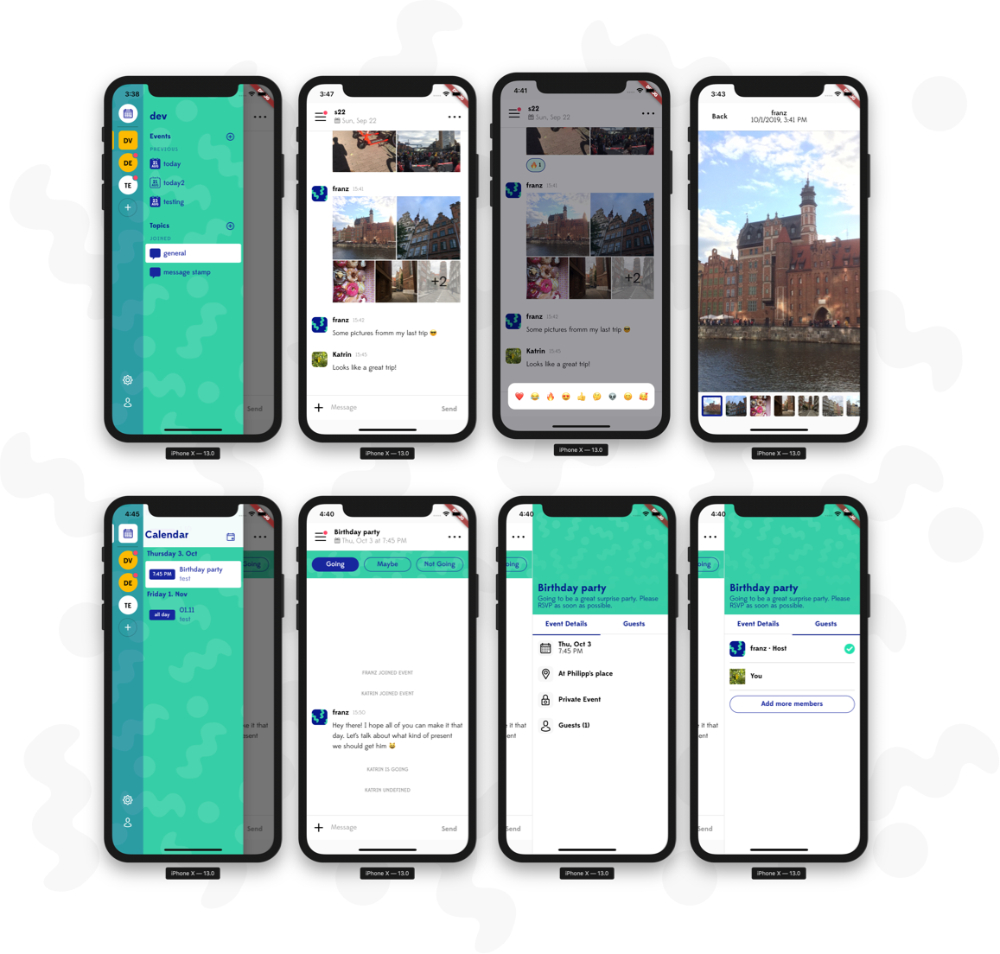

# Timy Group Messaging App

To facilitate seamless communication and collaboration among groups through a user-friendly messaging platform.

Timy is a dedicated group messaging app designed to help users connect and collaborate effortlessly. With features that prioritize group discussions, file sharing, and real-time notifications, Timy makes it easy for teams, friends, and families to stay organized and engaged.

# Main Features

- Multiple groups (similar to Teams in Slack).
- Multiple *open or private* channels within groups.
- Sharing of photos and photo collections.
- React to messages with emoji. 
- Push-notifications for the message and channel updates.
- Specific channels for events (e.g. containing date, venue).
- Editing of event channels.
- Calendar for all upcoming and past events aggregated over all groups and channels.
- English and German localization.
- RSVP for events.

